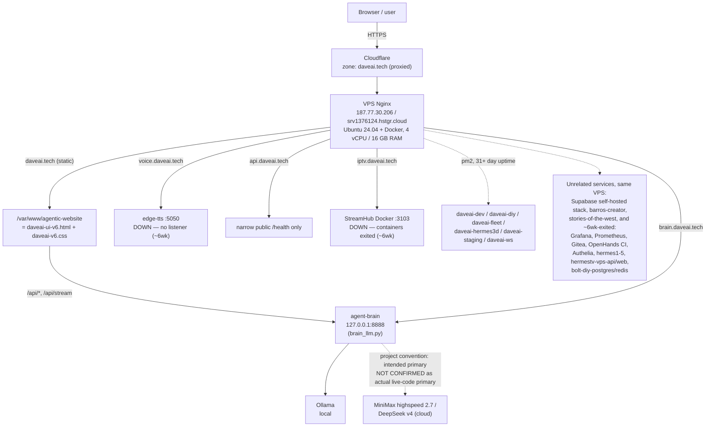
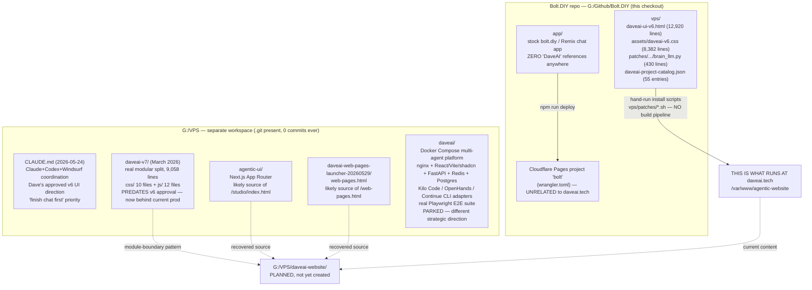
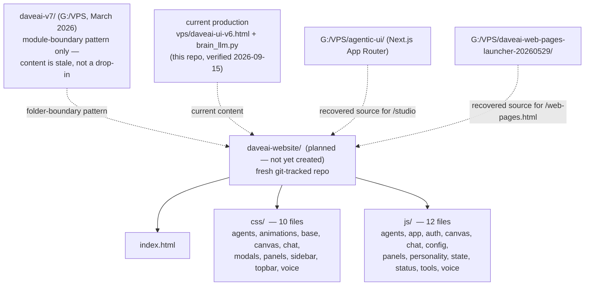

# DaveAI.tech Architecture Map — 2026-09-15

## 0. How to use this document

This is an orientation map, not a task list or a status report. It exists so any coding agent
(Devin, Kilocode, Codex, a future Claude session) or human picking up DaveAI.tech work can
understand what actually runs in production, where its real source lives, and which of the many
DaveAI-labeled folders on this machine are live, historical, or aspirational — without repeating
the discovery work this session already did.

Everything in "Production topology" (§2), "Today's incident" (§3), and "The multiple-codebases
reality" (§4) was directly verified in a single session on 2026-09-15: live SSH access to the
production VPS, direct reads of the files named below, and SHA-256 checksum comparison against
the running production copies. Status discipline used throughout, matching the sibling document
`docs/DAVEAI_DEEP_AUDIT_ROADMAP_20260915.md`:

- **verified** — read the code/data/live response directly this session, evidence stated inline.
- **reported** — an existing doc or proof artifact says so; not independently re-checked today.
- **open / not confirmed** — flagged explicitly; do not assume either answer.

Nothing in this document should be read as "complete," "fixed," or "production-ready" unless a
specific command, checksum, or HTTP response is cited next to the claim.

---

## 1. One-paragraph orientation (read this if nothing else)

The thing a browser sees at **daveai.tech** is one hand-written 12,920-line HTML file
(`vps/daveai-ui-v6.html`) plus an 8,382-line stylesheet (`vps/assets/daveai-v6.css`) and a
430-line Python backend (`vps/patches/daveai-production-runtime-20260731/brain_llm.py`), all
hand-deployed onto a Hostinger VPS with no build pipeline whatsoever. **This repository's `app/`
folder — a complete bolt.diy/Remix chat application — is unrelated to any of it**: zero "DaveAI"
references exist anywhere inside it, and it deploys to a different Cloudflare Pages project. A
second, much larger local workspace (`G:\VPS`, outside this repo entirely) holds a graveyard of
prior rebuild attempts (`daveai-v7/`, `agentic-ui/`, a launcher page, and a much bigger parked
Docker-Compose vision) plus the coordination notes that explain how they got there. None of those
are currently live either. A fresh, real, git-tracked rebuild (`G:\VPS\daveai-website\`) is
planned but does not exist yet as of this writing. Separately, today a Hostinger firewall
misconfiguration took the entire site offline; it has been fixed and verified recovered (§3). A
133-candidate bug audit of the actual live source is in progress, with 83 confirmed so far and 50
still pending re-verification (§7).

---

## 2. Production topology — verified live, 2026-09-15



### 2.1 Core facts

| Layer | Detail | Verification |
| --- | --- | --- |
| Edge | Cloudflare, zone `daveai.tech`, proxied | Live session, 2026-09-15 |
| Host | Hostinger VPS, `187.77.30.206`, hostname `srv1376124.hstgr.cloud`, Ubuntu 24.04 + Docker, 4 vCPU / 16 GB RAM | Live SSH session, 2026-09-15 |
| Main site | Static files from `/var/www/agentic-website`, i.e. `vps/daveai-ui-v6.html` + `vps/assets/daveai-v6.css` | Live session, direct file read + checksum, 2026-09-15 |
| Backend | Python process "agent-brain" on `127.0.0.1:8888`; Nginx proxies `/api/*` and `/api/stream` to it | Live session, `ss`/process check, 2026-09-15 |
| LLM routing | agent-brain talks to Ollama (local). Per project convention it is *intended* to primarily use MiniMax highspeed 2.7 and DeepSeek v4 (cloud), with Ollama as fallback only | **Open item** — not confirmed which is actually primary in the current live code. See §9. |

### 2.2 Subdomains

| Subdomain | Backend | Status (2026-09-15) | Notes |
| --- | --- | --- | --- |
| `daveai.tech` | Static site + agent-brain `:8888` | UP | Main site, described above |
| `brain.daveai.tech` | Proxies to the same agent-brain `:8888` | UP | |
| `voice.daveai.tech` | edge-tts on `:5050` | **DOWN** | No process listening at all. Unrelated to today's firewall incident; down roughly 6 weeks. |
| `api.daveai.tech` | Narrow public `/health` only | UP (narrow) | Only `/health` verified public; not a full API surface check. |
| `iptv.daveai.tech` | StreamHub, Docker `:3103` | **DOWN** | Containers exited ~6 weeks ago. |

### 2.3 pm2-managed processes

Six long-running Node processes, all online, 31+ days uptime as of 2026-09-15:

| Process | Status | Uptime |
| --- | --- | --- |
| `daveai-dev` | online | 31+ days |
| `daveai-diy` | online | 31+ days |
| `daveai-fleet` | online | 31+ days |
| `daveai-hermes3d` | online | 31+ days |
| `daveai-staging` | online | 31+ days |
| `daveai-ws` | online | 31+ days |

Note: none of these six names is `agent-brain` — what actually supervises `brain_llm.py` on
`:8888` was not identified among them. See open item in §9.

### 2.4 Other services on the same VPS (unrelated to DaveAI)

The box also runs a large number of Docker services that have nothing to do with DaveAI:

- **Running:** a Supabase self-hosted stack, `barros-creator` (web/api), `stories-of-the-west`.
- **Stopped/abandoned (~6 weeks ago):** Grafana, Prometheus, Gitea, OpenHands CI, Authelia,
  `hermes1`–`5`, `hermestv-vps-api`/`-web`, `bolt-diy-postgres`/`redis`.

These are documented here only so a future agent doesn't mistake them for part of the DaveAI
stack, or waste time investigating why they're stopped — treat them as out of scope unless told
otherwise (see open item in §9).

---

## 3. Today's incident (resolved, 2026-09-15)

A Hostinger cloud firewall group swap took the entire site offline (Cloudflare 522 on
`daveai.tech` and every subdomain) before being diagnosed and fixed this session.

| | |
| --- | --- |
| Root cause | A Hostinger firewall group named "Claude" — with exactly one rule, TCP 22 from a single `/32` IP — replaced the correct "Kilo" firewall group (TCP 22/80/443/5050/8080 from anywhere), which had been active since April. |
| Effect | With no 80/443 rule active, Cloudflare could not reach the origin at all: 522 on every hostname. |
| Fix | Reactivated the "Kilo" firewall group via the Hostinger API. |
| Verification | Health endpoints returned 200; SSH access confirmed working. |

For the exact group IDs, rule contents, and UTC timestamp of the swap, see
`docs/DAVEAI_DEEP_AUDIT_ROADMAP_20260915.md` §2, which documents this same incident in more
detail (Hostinger firewall group id `263387` for "Kilo"; "Claude" group created
`2026-09-15T01:48 UTC` with a single rule scoped to `35.196.153.210/32`).

```mermaid
sequenceDiagram
  participant Prior as Prior session
  participant HFW as Hostinger firewall
  participant CF as Cloudflare
  participant Site as daveai.tech origin
  participant This as This session

  Prior->>HFW: Create "Claude" group<br/>TCP 22 from one /32 IP only
  HFW->>HFW: "Claude" becomes sole active group,<br/>replacing "Kilo" (22/80/443/5050/8080,<br/>active since April)
  CF-xSite: 80/443 unreachable
  Note over CF,Site: Cloudflare 522 on daveai.tech + all subdomains
  This->>HFW: Reactivate "Kilo" via Hostinger API
  HFW->>Site: 22/80/443/5050/8080 reachable again
  This->>Site: curl health endpoints + ssh daveai uptime
  Site-->>This: 200 / 200 / 200; ssh ok, uptime shows no reboot occurred
```

The VPS itself never went down — only the firewall blocked traffic — which is consistent with the
uptime shown by `ssh daveai uptime` after the fix.

**Residual, non-urgent item:** the "Claude" group is now inactive but still exists on Hostinger.
Safe to delete later as cleanup; not urgent (its rule pointed at a sandbox egress IP that
reportedly can't use SSH productively anyway).

---

## 4. The multiple-codebases reality — pick the real one

This is the most important thing for any agent or human to internalize before touching anything.
There is no single "the DaveAI codebase." At minimum three distinct locations, and several
sub-attempts within one of them, all carry DaveAI-related code or content, and only one of them is
what a visitor to daveai.tech actually experiences.



### 4.1 What each location actually is

All rows verified via direct file reads and directory listings this session (2026-09-15) unless
marked otherwise.

| # | Location | What it actually is | Live at daveai.tech? |
| --- | --- | --- | --- |
| 1a | `G:\Github\Bolt.DIY\app\` | Stock, unmodified-in-spirit bolt.diy/Remix AI-chat-builder app. Zero "DaveAI" references anywhere (full-tree grep). `package.json` name is `"bolt"`; `wrangler.toml` present at repo root. | **No.** Deploys via `npm run deploy` to an unrelated Cloudflare Pages project named "bolt." |
| 1b | `G:\Github\Bolt.DIY\vps\` | [`daveai-ui-v6.html`](../vps/daveai-ui-v6.html) (12,920 lines, one hand-written file) + [`assets/daveai-v6.css`](../vps/assets/daveai-v6.css) (8,382 lines) + [`patches/daveai-production-runtime-20260731/brain_llm.py`](../vps/patches/daveai-production-runtime-20260731/brain_llm.py) (430 lines) + [`daveai-project-catalog.json`](../vps/daveai-project-catalog.json) (55 entries, fetched client-side by the HTML). | **Yes — this is the real thing.** Hand-deployed via `vps/patches/*.sh` shell scripts. No build pipeline. |
| 2 | `G:\VPS` | A separate, much larger, sprawling local workspace. Has a `.git` folder but **zero commits ever, on any branch** — despite looking like a repo, it has never actually been used for version control. | No single answer — see rows 2a–2e. |
| 2a | `G:\VPS\CLAUDE.md` | Coordination doc, dated 2026-05-24: documents a prior Claude+Codex+Windsurf division of labor on this exact product, Dave's approved UI direction (`daveai-ui-v6.html`'s current visual shell — dark command-center theme — must be preserved, not redesigned without explicit request), and the "finish chat first" priority (still Dave's stated priority as of 2026-09-15). | Reference document, not code. |
| 2b | `G:\VPS\daveai-v7\` | Genuine modular split of the same product (dated March 2026): `css/` (10 files) + `js/` (12 files) + `index.html`, 9,058 total lines. Real, substantial code. | **No** — predates Dave's 2026-05-24 approval of the current v6 direction, and a completed reconciliation found it now substantially behind current production. See §6. |
| 2c | `G:\VPS\agentic-ui\` | A Next.js (App Router) application. | Almost certainly the source for `/studio/index.html` ("DaveAI — Agentic Web Builder"), which could not be located anywhere else. |
| 2d | `G:\VPS\daveai-web-pages-launcher-20260529\web-pages.html` | A launcher page. | Almost certainly the source for `/web-pages.html`, referenced constantly (including inside `daveai-ui-v6.html` itself) but with no source anywhere else. |
| 2e | `G:\VPS\daveai\` | A much bigger, separate, partially-scaffolded vision: a Docker Compose multi-agent platform (nginx, React+Vite+shadcn frontend, FastAPI gateway, Redis, Postgres, plus adapters routing chat to real coding-agent CLIs — Kilo Code, OpenHands, Continue) with a real Playwright E2E spec suite already written (`chat.spec.ts`, `voice.spec.ts`, `agents.spec.ts`, `providers.spec.ts`, `ui.spec.ts`). | **Parked / for-later-discussion.** A different, bigger strategic direction — not a drop-in replacement for the current site. |
| 3 | `G:\VPS\daveai-website\` | **Not yet created.** Planned new project. | Future — see §6. |

### 4.2 `app/`'s own bug count, for the record

`app/` is confirmed low priority / parked per the project owner (Dave) — it's an accidental
container (DaveAI work ended up in whatever bolt.diy checkout happened to be open), not a second
product. It does, however, have 30 real, documented bugs of its own if anyone later revives it or
the separate `bolt` Cloudflare Pages deployment; the itemized list lives in this session's audit
trail and `docs/DAVEAI_DEEP_AUDIT_ROADMAP_20260915.md` §4.3–4.4, not reproduced here.

### 4.3 The verified drift between the repo and production

The repo's copy of `vps/daveai-ui-v6.html` and `vps/daveai-project-catalog.json` is not
byte-identical to what's live. Concretely: **the repo's catalog JSON still contains a
rejected/broken game page entry that production already fixed by hand weeks ago.** Redeploying the
repo's copy of that file as-is would undo that fix and put the broken page back in front of users.
This is the clearest evidence for why hand-deployed fixes keep going missing from source control —
there is no path for a fix made directly on the VPS to land back in git.

---

## 5. Physical location map (cross-drive)

Rediscovering where everything actually lives cost significant time this session. Recorded here so
the next agent doesn't have to repeat that work.

| Path | What's there | Relevance | Verification |
| --- | --- | --- | --- |
| `G:\Github\Bolt.DIY` | This repo, branch `chore/daveai-a11y-source-truth-20260725` | `app/` unrelated stock app; `vps/` is the real production source | Verified — direct file reads, 2026-09-15 |
| `G:\VPS` | Separate sprawling workspace; `.git` present, 0 commits ever | `CLAUDE.md`, `daveai-v7/`, `agentic-ui/`, launcher, `daveai/` Compose vision (§4) | Verified — direct file reads, 2026-09-15 |
| `G:\VPS\daveai-website\` | Not yet created | Planned clean modular rebuild location (§6) | N/A — planned only |
| `S:\Github\DAVE-AI-HARNESSED-CONTRACT-KIT-v1.0.0` | A contract-kit framework | Not DaveAI-specific, but a reusable audit/verification methodology worth referencing for future phased work | Verified — direct file read, 2026-09-15 |
| `C:\Users\Admin\Downloads\VPS\_work\` | An active Claude/Codex coordination staging folder | Referenced by `G:\VPS\CLAUDE.md` as an active staging area | **Reported** — per `G:\VPS\CLAUDE.md`, not independently re-opened this session |
| `K:\private\.env` | Hostinger API token and other credentials | Enabled today's firewall-group fix via the Hostinger API (§3) | Existence and purpose confirmed. Contents never read into or reproduced in this document, and should not be — reference its existence and purpose only. |

---

## 6. daveai-v7 reconciliation and the planned `daveai-website/` rebuild

### 6.1 `daveai-v7/` module boundaries (March 2026)

`G:\VPS\daveai-v7\` is real, substantial code — 9,058 total lines across `index.html` plus:

| `css/` (10 files) | `js/` (12 files) |
| --- | --- |
| `agents.css` | `agents.js` |
| `animations.css` | `app.js` |
| `base.css` | `auth.js` |
| `canvas.css` | `canvas.js` |
| `chat.css` | `chat.js` |
| `modals.css` | `config.js` |
| `panels.css` | `panels.js` |
| `sidebar.css` | `personality.js` (1,822 lines) |
| `topbar.css` | `state.js` |
| `voice.css` | `status.js` |
| | `tools.js` |
| | `voice.js` (2,088 lines) |

### 6.2 What current production has that v7 doesn't

A completed reconciliation workflow compared v7 against current production and found production
has since gained substantial functionality that does not exist in v7 at all:

| Capability | In `daveai-v7/`? | In current production? |
| --- | --- | --- |
| Manual agent-routing override by clicking a pill | No | Yes |
| Approval/governance gating layer that blocks and re-labels agents | No | Yes |
| "Narrator-first" routing gate — purely conversational messages go to a lighter-weight "Alice" narrator path; only action-keyword messages engage the full 4-agent pipeline | No | Yes |
| Tools-to-agent attribution catalog (~100+ tools mapped to their owning agent) | No | Yes |

**State plainly: `daveai-v7/` is now substantially behind current production and is not a safe
drop-in replacement.** It predates Dave's 2026-05-24 approval of the current v6 visual direction,
and current production has grown real functionality since that v7 never saw. Its value is the
proof that this product can be cleanly split into modules along these specific boundaries — not
its current file contents.

### 6.3 The planned rebuild: `daveai-website/` (not yet created)

A new clean project is planned at `G:\VPS\daveai-website\` — a fresh, real, git-tracked, modular
rebuild that:

- uses `daveai-v7`'s proven module boundaries (§6.1) as the pattern, not its stale content;
- is populated with **current**, not stale, content — i.e. today's `vps/daveai-ui-v6.html` +
  `brain_llm.py`, not the March 2026 v7 snapshot;
- incorporates the recovered `agentic-ui/` and `daveai-web-pages-launcher-20260529/` sources
  (§4.1, rows 2c–2d);
- is guided by the completed v7-vs-current reconciliation above.



The full reconciliation findings — beyond the four headline capabilities in §6.2 — will live in
`docs/DAVEAI_DEEP_AUDIT_ROADMAP_20260915.md` once that document's pending update pass lands. They
are referenced here, not fabricated or reproduced in full.

---

## 7. Section-by-section bug audit — status (in progress, not final)

A section-by-section audit of the live source (`vps/daveai-ui-v6.html`, `brain_llm.py`, the CSS,
and the infra scripts) is underway.

| Metric | Count |
| --- | --- |
| Candidate findings identified | 133 |
| Independently confirmed as real | 83 |
| Pending re-verification | 50 |

**On the 50 pending items:** an unrelated rate-limit interruption stopped the verification run
partway through. Those 50 are **not confirmed false** — they are unverified and pending a retry.
Do not treat "pending" as "rejected."

Notable findings among the 83 confirmed, worth naming specifically:

- **Security issue, not just a bug:** an AI-generated preview iframe resolves to same-origin URLs
  instead of being sandboxed — a potential vector for cookie/localStorage/parent-DOM access from
  untrusted generated content.
- **Access control gap:** an admin panel can be opened via a sidebar click with no role or auth
  check at all, immediately exposing internal infrastructure details — the Brain URL, the LiteLLM
  port, the ZeroClaw port, and the raw VPS IP — to any visitor.
- **Accessibility:** the entire Settings modal (~23 toggles) and the primary sign-in/sign-up form
  have no accessible names for screen readers.

The full 133-item findings list lives in `docs/DAVEAI_DEEP_AUDIT_ROADMAP_20260915.md`, pending an
update pass to incorporate it in detail. It is not fully reproduced here.

---

## 8. Related docs in this folder — freshness map

`docs/` contains documents spanning roughly four months of this project's history, describing at
least two materially different backend architectures. Read dates carefully before trusting a
claim from any of them over what's in this document.

| Doc | Dated | Describes | Current relevance (as of 2026-09-15) |
| --- | --- | --- | --- |
| `DAVEAI_SYSTEM_MAP.md` | 2026-05-30 | A Next.js server on `:3001` (pm2 `agentic-ui`), Authelia auth on `:8888`, and a much wider set of live subdomains (`openhands`, `hermes`, `hermes-webui`, `webui`, `auth`) | **Superseded.** Today's verified backend is static HTML + `agent-brain` on `:8888` (Python, not Authelia); no Next.js on `:3001` was part of today's verification. Kept for historical reference to an earlier box configuration only. |
| `DAVEAI_PORT_REGISTRY.md` | 2026-05-31 | Same-era port allocations (`:3001` DaveAI Next.js, `:8787` Hermes WebUI, etc.) | Same caveat as above. The pm2 process list has since changed entirely (§2.3) — not re-verified today. |
| `DAVEAI_SUBDOMAIN_STATUS.md` | 2026-05-30 | Per-subdomain HTTP status, including `dev.`, `diy.`, `fleet.`, `staging.`, `hermes3d.daveai.tech` all returning 503 "intentional placeholder — not built" | **Possibly superseded** by today's six online pm2 processes named `daveai-dev`/`-diy`/`-fleet`/`-hermes3d`/`-staging`/`-ws` (§2.3) — whether those now serve live content behind these subdomains was **not** re-verified this session. See open item, §9. |
| `DAVEAI_RC1_TO_RC2_HANDOFF_20260801.md` / `DAVEAI_RC2_E2E_ROADMAP_20260801.md` | 2026-08-01 | RC1 production repair and the RC2 test/maintenance plan; already correctly identifies the `agent-brain:8888` → Ollama topology | Consistent with §2 of this document. Still the right reference for the E2E test runner (`vps/production-e2e-runner.cjs`). |
| `DAVEAI_DEEP_AUDIT_ROADMAP_20260915.md` | 2026-09-15 | Same-day deep audit: source-of-truth map, today's incident in full detail, phased plan, contract kit | This document's closest sibling, cross-referenced throughout. Still pending its own update pass (§10). |
| `vps/DAVEAI_SOURCE_OF_TRUTH.md` | File dated 2026-07-25 | Declares `daveai-ui-v6.html` + `assets/daveai-v6.css` + `patches/agent-runtime-completion-20260724-src/` canonical, and asserts these must stay byte-identical across copies | The byte-identical invariant is already reported false by `DAVEAI_DEEP_AUDIT_ROADMAP_20260915.md` (three different SHA-256 hashes across the repo copy, production, and the patch-bundle copy). Treat this file's canonical-source claims as aspirational, not verified current state. |

---

## 9. Consolidated open verification items

Everything below is an explicit gap, not a quiet assumption. Do not resolve these by guessing.

1. **LLM routing primary.** Whether Ollama or MiniMax highspeed 2.7 / DeepSeek v4 is actually
   primary in the currently-live `brain_llm.py` code. Project convention says cloud-first with
   Ollama as fallback only; this was not confirmed against the live code this session (§2.1).
2. **50 pending bug-audit findings.** Interrupted mid-verification by an unrelated rate limit —
   not confirmed true or false either way (§7).
3. **What supervises `agent-brain`/`brain_llm.py` on `:8888`.** None of the six pm2 processes
   verified today is named for it (§2.3). Could be pm2 under an unlisted name, systemd, or run
   manually — not identified this session.
4. **Whether the six pm2 subdomain-named processes are actually live.** `daveai-dev`, `-diy`,
   `-fleet`, `-hermes3d`, `-staging` correspond by name to subdomains that
   `DAVEAI_SUBDOMAIN_STATUS.md` (2026-05-30) recorded as 503 placeholders. Not re-checked this
   session (§8).
5. **Voice / IPTV / HermesTV disposition.** `voice.daveai.tech` and `iptv.daveai.tech` have been
   down roughly six weeks, unrelated to today's incident. No decision yet on restart, leave as-is,
   or formally decommission (§2.2, §2.4).
6. **"Claude" firewall group cleanup.** Now inactive but not deleted. Low urgency (§3).
7. **The `bolt` Cloudflare Pages deployment's own fate.** Whether it's still live/reachable by
   anyone was not checked this session — separate question from whether `app/` itself is worth
   fixing (§4.2).
8. **`vps/patches/agent-runtime-completion-20260724-src/`.** `vps/DAVEAI_SOURCE_OF_TRUTH.md` calls
   it a required byte-identical sync target; it's reported to match neither the repo's main copy
   nor production. Whether it's an archival snapshot or a real invariant to restore is undecided
   (§8).
9. **`C:\Users\Admin\Downloads\VPS\_work\` current status.** Stated as an active staging folder in
   `G:\VPS\CLAUDE.md` (dated 2026-05-24); not independently re-opened this session (§5).

---

## 10. What this doc does not yet cover

- The full 133-item bug-audit findings list — only three notable examples are named in §7. The
  complete list, with the 50 pending items resolved, belongs in
  `docs/DAVEAI_DEEP_AUDIT_ROADMAP_20260915.md` once its pending update pass lands.
- The full v7-vs-current-production reconciliation detail beyond the four headline capability gaps
  in §6.2 — same pending update pass, same document.
- A line-by-line audit of `daveai-ui-v6.html`'s chat logic and `brain_llm.py` itself (proposed as
  "Phase 1" in `DAVEAI_DEEP_AUDIT_ROADMAP_20260915.md`'s phased plan) — not started as of this
  document's date.
- Any actual content for `G:\VPS\daveai-website\` — it does not exist yet. This document records
  only the plan and its intended sources (§6.3).
- A full per-endpoint audit of `api.daveai.tech` beyond its public `/health` route.

Treat `docs/DAVEAI_DEEP_AUDIT_ROADMAP_20260915.md` as the living document for all of the above; it
still needs a full update pass to incorporate the complete bug-audit and reconciliation results in
detail.
