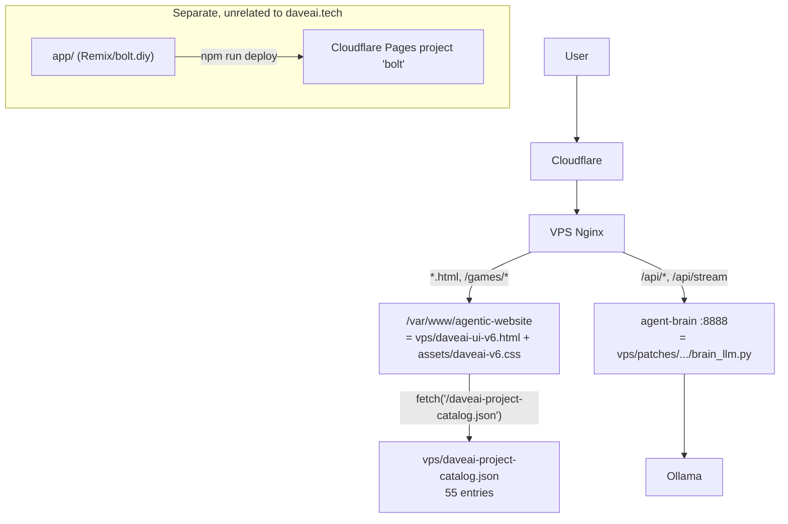

# DaveAI.tech Deep Audit & Completion Roadmap — 2026-09-15

Requested by the owner: an end-to-end, multi-agent audit of DaveAI.tech (chat, menus, games,
extensibility for new "wildcard" site entries), documented as a phased roadmap + contract kit.
This document is that deliverable. It supersedes nothing in `docs/DAVEAI_RC1_TO_RC2_HANDOFF_20260801.md`
or `docs/DAVEAI_RC2_E2E_ROADMAP_20260801.md` — it builds on them and corrects one load-bearing
assumption those docs made (see §1).

Status discipline used throughout: **verified** = read the code/data/live response myself or an
agent did, with evidence quoted. **reported** = a doc or proof artifact says so, not independently
re-checked today. Nothing here is described as "complete," "fixed," or "production-ready" unless
a specific proof command/output is cited next to the claim.

---

## 0. Executive summary

1. **The live chat/menu/games UI is not this repo's `app/` folder.** It's a single hand-written
   12,920-line file, [`vps/daveai-ui-v6.html`](../vps/daveai-ui-v6.html), plus
   [`vps/patches/daveai-production-runtime-20260731/brain_llm.py`](../vps/patches/daveai-production-runtime-20260731/brain_llm.py)
   as the chat backend (port 8888). `app/` is a normal, disconnected bolt.diy/Remix app that
   builds and deploys to an unrelated Cloudflare Pages project ("bolt"). Any audit or fix aimed at
   `app/components/chat/*` does not touch what a daveai.tech visitor experiences. **Confirmed by
   two independent agents plus a direct grep (zero cross-references either direction).**
2. **There is no deploy pipeline.** Production is updated by hand-running shell scripts
   (`vps/patches/*.sh`) that `install` files straight onto `/var/www/agentic-website`. Nothing
   automatically pulls production fixes back into git. Result, found today: the repo's
   `vps/daveai-project-catalog.json` still contains the pre-fix, rejected "Checkers Crowning
   Draft" entry (URL literally named `checkers-game-crowning-jumping-do-not.html`) that production
   replaced weeks ago. **If that file is ever redeployed from the repo as-is, it puts the broken
   page back in front of users and silently undoes a fix that already shipped.** This is the
   clearest evidence for why things "keep getting skipped" — fixes made directly on the VPS have
   nowhere to land in source control.
3. **Today's incident:** daveai.tech and every subdomain were fully down (Cloudflare 522) because
   a firewall group swap on the Hostinger VPS this morning left only one narrow SSH rule active,
   blocking 80/443 entirely. **Fixed and verified** during this session (§2). Two other services
   on the same box — voice (edge-tts) and the IPTV/StreamHub stack — are also down, but that's
   unrelated and roughly six weeks old; open decision in §6.
4. **Update — the real chat/menu file has now been deep-audited.** A section-by-section pass
   over `vps/daveai-ui-v6.html`, `brain_llm.py`, the CSS, and the infra scripts produced 133
   candidate findings; every one was independently re-verified against the live file before
   counting, and **130 held up**. Full detail: [`DAVEAI_CONFIRMED_FINDINGS_20260915.md`](DAVEAI_CONFIRMED_FINDINGS_20260915.md).
   **9 of the 130 are security findings**, not cosmetic bugs — stored XSS in the admin users list,
   a `postMessage` handler with no origin check, a same-origin sandbox escape in the AI-preview
   iframe, an unauthenticated admin panel that hands any visitor the raw VPS IP and internal
   service ports, a hardcoded shared secret in an nginx config, and missing rate-limiting on
   `brain.daveai.tech`, among others. 3 more are WCAG Level-A accessibility failures the
   independent verifiers called blocking, not minor: the sign-in form and all 23 Settings-modal
   toggles have no screen-reader-accessible names at all. These are now Phase 0/1's actual
   contents, not hypothetical scope — see §5.

5. **A separate reconciliation** compared the March-2026 modular split (`G:\VPS\daveai-v7\`) against
   current production, module by module, to ground the later rebuild at `daveai-website/`. Every
   comparison that had a clear winner favored current production, none favored v7 — v7 is a sound
   structural pattern, not something safe to resume as-is. Full detail:
   [`DAVEAI_V7_RECONCILIATION_20260915.md`](DAVEAI_V7_RECONCILIATION_20260915.md).

6. **Full architecture, diagrams, and physical file-location map** (which drive has what, and why)
   now live in [`DAVEAI_ARCHITECTURE_MAP_20260915.md`](DAVEAI_ARCHITECTURE_MAP_20260915.md) —
   including a resolved open item: `brain_llm.py` on the VPS is supervised by systemd unit
   `agent-brain.service`, not any of the six pm2 processes. Also worth knowing before it misleads
   anyone: `voice.daveai.tech`'s root path returns HTTP 200 (a static landing page) even though
   nothing listens on the actual TTS port — a plain health check on `/` would falsely suggest that
   service is back.

7. **A full contract kit exists now**, not just the sketch in §Contract kit below — six per-phase
   JSON contracts plus an index under [`docs/contracts/`](contracts/CT-INDEX.json), overview at
   [`DAVEAI_CONTRACT_KIT_20260915.md`](DAVEAI_CONTRACT_KIT_20260915.md). None are marked authorized
   to start; producing the kit is preparatory, not permission.

8. **A tool-agnostic handoff doc exists** at [`DAVEAI_HANDOFF_20260915.md`](DAVEAI_HANDOFF_20260915.md)
   (mirrored to `G:\VPS\HANDOFF.md`) for Devin/Kilocode/Codex/a future session picking this up cold.

---

## 1. Source-of-truth map

| Surface | Real source in this repo | Confidence |
| --- | --- | --- |
| Main chat UI, topbar, sidebar | [`vps/daveai-ui-v6.html`](../vps/daveai-ui-v6.html) (12,920 lines, one file) | High — string-matched against live E2E selectors and a fresh production fetch |
| Chat backend | [`vps/patches/daveai-production-runtime-20260731/brain_llm.py`](../vps/patches/daveai-production-runtime-20260731/brain_llm.py), served on 127.0.0.1:8888 | High — confirmed listening via `ss -ltnp` on the box today |
| Styling | [`vps/assets/daveai-v6.css`](../vps/assets/daveai-v6.css) (8,382 lines) | High |
| Games/apps catalog + carousel | [`vps/daveai-project-catalog.json`](../vps/daveai-project-catalog.json) — carousel is `projects.filter(cat==='games' && status==='live')`, nothing more | High, but see §4.2 for how scattered the *full* mechanism actually is |
| `/web-pages.html` launcher | **Not in this repo at all.** Lives only on the VPS. Not listed in `vps/DAVEAI_SOURCE_OF_TRUTH.md`'s "authoritative deployment inputs." | Confirmed absent (`find` returned nothing) |
| `/studio/index.html` ("Agentic Web Builder") | **Not in this repo either** — catalog marks it `needs-proof`, no build output or CI step produces it anywhere in this tree | Unresolved — needs a direct look at the VPS, not more repo searching |
| `app/` (this repo's Remix chat app) | Real, working code, deployed to Cloudflare Pages project `bolt` (`wrangler.toml`) — **not** daveai.tech | High (zero cross-references in either direction; different SSE protocol, no auth layer at all) |

**Drift check run today:** `git show HEAD:vps/daveai-ui-v6.html` vs. a fresh `curl` of the live
page differ in exactly 64 lines. Real content: production has a `shouldLaunchExternally()`
guard (opens auth/protected projects in a new tab with a pop-up-blocked fallback message) that
the repo copy lacks; a CSS cache-bust bump; a couple of `type="button"` hardening attributes; the
rest is Cloudflare's own injected bot-check script, not a real difference. Small and specific —
listed as a Phase 0 item below. The separate `vps/patches/agent-runtime-completion-20260724-src/`
copy that `vps/DAVEAI_SOURCE_OF_TRUTH.md` claims must stay byte-identical to the main file does
**not** match either the repo's main copy or production (three different SHA-256 hashes across
all three). Treat it as a stale historical snapshot, not a sync target, until proven otherwise.

---

## 2. Today's incident (resolved)

| | |
| --- | --- |
| Symptom | daveai.tech and all subdomains: Cloudflare 522, no response on 22/80/443 from anywhere |
| Root cause | Hostinger VPS firewall group "Claude" (created 2026-09-15T01:48 UTC by a prior session) became the sole active group, with exactly one rule: `TCP 22 from 35.196.153.210/32`. No 80/443 rule at all. |
| Fix applied | Reactivated the pre-existing "Kilo" firewall group (id 263387: TCP 22/80/443/5050/8080 from anywhere) via the Hostinger API, with the owner's explicit go-ahead. |
| Verification | `daveai.tech/api/health` → 200, `brain.daveai.tech/health` → 200, `api.daveai.tech/health` → 200, `ssh daveai uptime` → succeeds (44 days uptime, so the box itself never went down — only the firewall blocked traffic). |
| Residual risk | The "Claude" group is now inactive but still exists. Its only rule was pointed at a claude.ai sandbox egress IP that (per the handoff doc) can't actually use SSH anyway — safe to delete later as cleanup, not urgent. |

**Found while verifying, not caused by today's incident — separately down for ~6 weeks:**

| Subdomain | Status | Why |
| --- | --- | --- |
| `voice.daveai.tech` | 502 | Nothing listens on :5050. No matching pm2, docker, or systemd unit found. |
| `iptv.daveai.tech` | 502 | StreamHub's docker containers (`iptv-restream-*`) show `Exited 6 weeks ago`. |
| `hermestv.daveai.tech` / `tv.daveai.tech` | 502 (per nginx error log) | `hermestv-vps-api`/`-web` containers also `Exited 6 weeks ago`; nginx repeatedly fails to reach `127.0.0.1:3080`. |

Everything else on the box (Supabase stack, `barros-creator-*`, `stories-of-the-west`, the six
`daveai-*` pm2 processes) is currently running. A large number of other containers
(Grafana/Prometheus, Gitea, OpenHands CI, Authelia, `bolt-diy-postgres/redis`, `hermes1`–`5`,
`aice-*`) are also `Exited 6 weeks ago` — presumably the same event took all of these down at
once, and only the ones with a restart policy (or pm2's own resurrection) came back. **Decision
needed from you — see §6.**

---

## 3. Priority, per your own framing

You were explicit: **chat completion is the top priority**, then menus/tabs, then games, then
making it easy to keep adding your other sites as "wildcard" entries. The phases below follow
that order. Nothing here should be read as "do all of this before touching chat" — Phase 1 can
start immediately and independently of Phases 2–4.

## 4. Findings so far, by area

### 4.1 The real chat/menu file — audited, 130 confirmed findings

`vps/daveai-ui-v6.html` and `brain_llm.py` are where "get the chat working, get it finished"
actually has to happen. A section-by-section pass (9 sections of the HTML plus the backend, CSS,
and infra scripts) found 133 candidate issues; a second, independent agent re-checked each one
against the live file before it counted, and rejected only 3. Full list, organized by severity and
area with exact file:line evidence: [`DAVEAI_CONFIRMED_FINDINGS_20260915.md`](DAVEAI_CONFIRMED_FINDINGS_20260915.md).

Breakdown: 9 security, 30 broken/non-functional, 55 degrades-quality, 21 accessibility-gap, 15
cosmetic-polish, 0 fully chat-blocking. The verifiers didn't just confirm or reject — several
argued the original severity was too low (e.g. reclassifying "broken-non-functional" findings as
real security or WCAG-critical issues once they traced the actual impact), and those corrections
are reflected in the numbers above, not the raw audit output.

### 4.2 Games catalog & "add more sites" extensibility — audited

- The mechanism is **not** one clean registry. The same facts about the same 55 entries are
  encoded independently in five places: `daveai-project-catalog.json`, a hardcoded
  `PROJECT_CATALOG_HOST_STATUS` map inside the HTML, a hardcoded `seedProjects()` list (different
  IDs for the same three carousel games), `verify-source-of-truth.py`'s hardcoded expectations
  (including a hard assertion that there are exactly 55 entries — adding a 56th breaks the
  verifier until someone remembers to bump that number), and `daveai-sites-config.json` for
  infra/nginx health. `/web-pages.html` — the page that most literally matches what you described
  as the "wildcard" launcher — has no source in the repo at all, so editing the catalog JSON will
  not change what it shows.
- **Concrete, already-happened proof this drift is dangerous, not theoretical:** see the
  Checkers Crowning finding in §0.2.
- **Good news for the wildcard-sites goal:** the schema already has an unused `"other"` category
  (`web | apps | games | other`) sitting idle — a natural, low-effort home for your external sites
  once the registry itself is consolidated. Setting `embed:false` on an entry already makes it
  render as a launch card instead of an iframe, which is what you'd want for sites you don't
  control.
- **Testing depth is much shallower than the prose in older docs implies.** The committed,
  CI-running suite (`vps/production-e2e-runner.cjs`) only ever checks that a game's page loads
  and a canvas/title exists — it never clicks or presses a key, for any game, including the three
  "core" ones. Across this repo's entire history, exactly one game (Asteroids) has ever had a real
  gameplay assertion (score changed via simulated input). TD2, Siege TD, and all ~14 arcade/board
  games (including Checkers Crowning's own crowning mechanic) have only ever been confirmed to
  *load*, not to *work*. Treat "smoke tested" and "verified working" as different claims going
  forward.

### 4.3 `app/` — stock bolt.diy chat (audited, but confirm relevance first)

Two agents independently confirmed `app/` shares no code with daveai.tech. It does have its own
13 real, evidenced findings (3 severe: a first-message flow that can hang forever by default on
every new chat via an uncaught `JSON.parse` error; a stream-recovery manager that logs a timeout
but never actually recovers anything; an "Enhance prompt" button that can permanently lock up and,
separately, can silently overwrite what you typed with a raw error string while telling you it
worked). Full detail is in this session's transcript if you want it later. **Whether this is worth
fixing depends entirely on one question for you: is the `bolt` Cloudflare Pages deployment one of
your other real sites (or a template you plan to reuse), or is it dead weight from the original
fork?** See §6.

### 4.4 Menu/nav/settings audit of `app/` — complete

**Context (from the owner, 2026-09-15):** `app/` isn't a second product — DaveAI work ended up
inside whatever bolt.diy checkout happened to be open at the time, likely after an earlier DaveAI
checkout was lost/misplaced and this became a de facto backup location. That matches the audit
exactly: a repo-wide, case-insensitive search found **zero** "DaveAI" references anywhere in
`app/`. The live browser-tab title, `package.json` name, and a long list of functional
strings/URLs sent to real APIs still say "Bolt" / "bolt.diy" / "StackBlitz" — the rebrand never
touched this folder at all.

Given that, treat the following as recorded-for-the-record, low priority unless told otherwise —
full detail is in this session's transcript:

- **2 fully-built screens are unreachable dead ends** (a Tab Management panel nothing ever opens;
  a Settings sub-tab that writes to a localStorage key nothing else reads).
- **A fake "new feature" badge** is explicitly commented `TODO: mock implementation` and can never
  re-trigger once dismissed — one of its two hardcoded "features" is the dead Tab Management panel.
- **5 provider tiles (GitHub/GitLab/Netlify/Vercel/Supabase) share one meaningless health check** —
  whether the app server itself is reachable — so a local blip flags all five at once, and an
  actually-expired token never gets flagged.
- **A backup/restore round-trip can permanently sign you out of GitLab, Vercel, and Supabase with
  no recovery path** (export only covers Netlify+GitHub; reset wipes everything).
- **~10 duplicate or orphaned implementations** of the same feature (two GitHub connection stores,
  two tab-config stores, two ~1000-line unused "connection panel" files with visible
  "debug — remove this later" scaffolding, one of which logs a live access token on every render).
- **The sidebar has no click or keyboard way to open it** — mouse-proximity to the screen edge
  only.
- **17 separate accessibility gaps**, most fanning out from 4 shared primitives (`IconButton` and
  `Switch` structurally can't carry `aria-label`; `Dialog`'s close button and the entire Settings
  tile grid are plain unlabeled `
`s with no keyboard path) — fixing those 4 files would
  resolve most of the list at once, if this codebase is ever picked back up.

**Bottom line:** nothing here blocks or interacts with the real daveai.tech chat/menus in
§4.1/§4.3. Safe to leave parked.

### Catalog investigation — closed out
A follow-up sweep for any catalog/carousel/launcher references outside what was already reviewed
came back empty (only incidental substring matches inside build output and unrelated bolt.diy
prompt files). §4.2 stands as the complete picture.

---

## 5. Phased plan

### Phase 0 — Stop the bleeding (small, low-risk, do first)
1. Fix `vps/daveai-project-catalog.json` in the repo to match the safe, already-live Checkers
   Crowning entry, so a future redeploy from this repo can't regress it.
2. Pull the 64-line production diff (external-launch handling, cache-bust version, `type="button"`
   attributes) back into `vps/daveai-ui-v6.html` so the repo stops being the stale copy.
3. Decide what `vps/patches/agent-runtime-completion-20260724-src/daveai-ui-v6.html` actually is
   (archival snapshot vs. required sync target) and correct `vps/DAVEAI_SOURCE_OF_TRUTH.md` to
   match reality instead of an invariant that's already silently false.
4. Put a real "pull production back into git" step somewhere (even a manual checklist item in the
   existing `vps/patches/*.sh` scripts) so this stops being silent.

### Phase 1 — Chat completion (top priority)
The audit is done (§4.1); this phase is now fixing what it found. Start with the 9 security
findings and the sign-in-form accessibility failure in
[`DAVEAI_CONFIRMED_FINDINGS_20260915.md`](DAVEAI_CONFIRMED_FINDINGS_20260915.md)'s "Fix First"
section — those sit in or gate the chat/auth path. Contract: `docs/contracts/CT-001-chat-completion.json`.
Cross-reference [`DAVEAI_V7_RECONCILIATION_20260915.md`](DAVEAI_V7_RECONCILIATION_20260915.md) for
chat-area functionality that only exists in current production (must be preserved, not just
"fixed") versus what v7 had that current doesn't (flagged there for a decision, not assumed).

### Phase 2 — Menus, tabs, topbar/sidebar polish
Same file, different section (`#topbar`, sidebar icon rail, settings panels) — the 21 accessibility
findings and the remaining broken/degraded menu-nav items in
[`DAVEAI_CONFIRMED_FINDINGS_20260915.md`](DAVEAI_CONFIRMED_FINDINGS_20260915.md) live here,
including the 23-toggle Settings modal a11y failure. Contract: `docs/contracts/CT-002-menu-nav-polish.json`.

### Phase 3 — Games catalog consolidation
Collapse the five-places-at-once catalog mechanism (§4.2) into one real source, add the missing
`web-pages.html` source into the repo, and add at least one real input-driven test per game beyond
Asteroids before calling any of them "working." Contract: `docs/contracts/CT-003-games-catalog-consolidation.json`.

### Phase 4 — Wildcard site extensibility
Once Phase 3's registry is real and singular, wire the existing unused `"other"` category into the
launcher UI as the place your additional sites go, with `embed:false` as the default for anything
you don't control. Contract: `docs/contracts/CT-004-wildcard-extensibility.json`.

### Phase 5 — Open strategic questions
`app/`'s fate (§4.3), the six-week-dead voice/IPTV/TV stack (§2), and how the separate Alice's
Arena / VPS-backend thread (from today's handoff doc) folds into this same box and this same
catalog once those deliverables are located.

---

## 6. Decisions — resolved 2026-09-15

1. ~~Voice / IPTV / HermesTV~~ **Resolved: leave down for now.** Not touched.
2. ~~`app/`'s fate~~ **Corrected, not just resolved.** `bolt.pages.dev` (the Cloudflare Pages
   target) is confirmed dead-end — it's an unrelated third party's generic demo page, not
   `app/`'s deployment. But **`app/` is not dead weight after all**: the catalog lists a real
   `bolt.daveai.tech` entry ("Bolt.diy coding surface protected by DaveAI authentication"), and
   its nginx vhost proxies to `localhost:5173` — a Vite dev server, i.e. this exact `app/` folder.
   It currently 500s because **Authelia (the shared auth gateway for `bolt.daveai.tech`, `dev.`,
   `staging.`, `diy.`, `fleet.`, `hermes.`, and the game portal) has a broken config** — its
   container exits immediately on start with `yaml: line 68: found character that cannot start
   any token`, plus five more missing-required-section errors (no authentication_backend, no
   storage, no notifier, no session cookie config, no access_control default policy). This isn't a
   quick restart — it needs an actual config built out, and no attempt was made to write one blind
   given it's a shared auth gateway. Also nothing currently listens on :5173 even once auth would
   pass. **Correction to §4.3/§4.4/§5 Phase 5:** `app/`'s 13 findings are not "parked, low
   priority" — they're blocked on infrastructure, not irrelevant. Revisit once Authelia has a real
   config plan.
3. ~~Pace~~ **Resolved: yes, start now — done, see below.** Security findings were pulled forward
   ahead of the full Phase 1 pass per your steer.

### What's actually fixed as of 2026-09-15 (repo only, not deployed)

**Status as of the latest batch (Batch 6 — Auth & Session, remaining CSS/Backend): 130 of 130
confirmed findings addressed. 0 open.**

**Read that plainly, not as "zero bugs" or "complete":** it means every one of the 130 confirmed
findings from the original audit has been fixed outright, correctly reclassified as not-a-bug,
honestly relabeled instead of guess-implemented, or deliberately deferred with a documented
reason sitting at its exact location in the code. **11 of those 130 are real, still-open gaps
left deliberately unfixed** — S5 (hardcoded nginx secret), S7 (hardcoded VPS IP/ports in public
HTML), 2 Infra items (a hardcoded health-check response; a dual-hardcoded site count with only
partial mitigation), Voice Blend/Moshi/icon-pack-switching (three real unbuilt features, not
bugs), VISION wiring, `/api/stream`'s missing idempotency key, `_dbSyncUser`'s display-name
collision, and the BrainState/`pollBrain` polling-consolidation claim (corrected to stop claiming
something that isn't true, but not actually consolidated) — every one needs either a server-side
change outside this repo, a coordinated secret rotation, or genuinely new feature work, not a
quick edit. Full per-finding detail, exact evidence, and this batch's write-up:
[`DAVEAI_CONFIRMED_FINDINGS_20260915.md`](DAVEAI_CONFIRMED_FINDINGS_20260915.md).

By area, all fully addressed: Fix-First 12/12 (10 fixed, S5+S7 deferred) · Infra 6/6 (4 fixed, 2
deferred) · Menu & Navigation 20/20 fixed · Other 14/14 fixed · Settings Panel 23/23 (19 fixed, 1
reclassified, 3 deferred) · CSS 10/10 (8 fixed in the external file, 2 fixed this batch in the
inline `<style>` block) · Backend 8/8 (5 fixed across both batches, 3 documented gaps) · Chat
32/32 (31 fixed/reclassified/relabeled, 1 partially — dead code removed, idempotency gap
documented) · Auth & Session 5/5, all fixed this batch (a generic-JSON auth-error page for the
`iptv.daveai.tech` provider-vault prefix instead of an HTML redirect; the Admin Dashboard now
starts for an admin who authenticates mid-session, not just one already holding a token at page
load; the legacy admin-login fallback no longer hardcodes one email or fakes `role:'admin'` on
every success; profile-save no longer reports success for a save that never contacted the server;
the admin panel's duplicate auth-header helper no longer sends a garbage `Authorization` header
when logged out).

**Two corrections worth naming plainly:** this document previously listed Settings at 22/23 (1
open — an Icon/Theme Studio grid-timing item) and Chat's History-rows keyboard-accessibility
finding as unaddressed. Both turned out to already be fixed, from earlier batches, as side
effects of other work that was never explicitly checked against those specific findings. That's
the second and third time in this project that batch-narrative trust understated real progress
instead of overstating it — the opposite failure mode from the usual worry, but a failure mode of
the same root cause (claiming status without checking the file). Every number in this update was
re-verified against actual file content, not carried forward from a prior batch's own summary.

**Nothing in this list is deployed to production** — it exists only in this git working tree
pending review and an explicit deploy step, and this 130/130 figure has **not** been re-verified
by a fresh independent reviewer with no stake in the prior work — an independent review pass, and
a deliberate (not casual) decision on the 11 real deferred items above, are the honest next steps,
not a victory lap. Total diff so far (`git diff --stat`): `vps/daveai-ui-v6.html` alone is
~1,000+ lines changed across roughly 90 individual fixes; see `git diff --stat` for the full
multi-file total.

## Contract kit — now real, not just a sketch

The shape below is implemented as actual, usable files: six JSON contracts (`CT-000` through
`CT-005`, one per phase above) plus an index, all under [`docs/contracts/`](contracts/CT-INDEX.json),
with a readable overview at [`DAVEAI_CONTRACT_KIT_20260915.md`](DAVEAI_CONTRACT_KIT_20260915.md).
Every contract carries the standing rules below, plus phase-specific scope, protected paths, and
`known_findings` entries linking back to the specific confirmed issues (including the 3 named
security/accessibility ones) that make up that phase's real work. **All six are `status:
"not_started"`** — the kit's existence is preparation, not authorization to begin.

| Field | Requirement |
| --- | --- |
| Scope | Exact file(s)/line ranges, stated explicitly — not "the chat," `vps/daveai-ui-v6.html` lines X–Y |
| Protected paths | Nothing outside scope touched without saying so |
| Required evidence | Exact command + output for any "fixed" claim (a proof script, a curl, a screenshot) — not narrative confidence |
| Forbidden claims | No "100% complete," "everything works," "production-ready," "no bugs remain" without the proof line right next to it |
| Definition of done | Stated per-phase before starting, checked off with evidence, not assumed |

## Related documents produced this session

- [`DAVEAI_ARCHITECTURE_MAP_20260915.md`](DAVEAI_ARCHITECTURE_MAP_20260915.md) — full topology, diagrams, physical file-location map across every drive
- [`DAVEAI_CONFIRMED_FINDINGS_20260915.md`](DAVEAI_CONFIRMED_FINDINGS_20260915.md) — all 130 confirmed findings, detailed
- [`DAVEAI_V7_RECONCILIATION_20260915.md`](DAVEAI_V7_RECONCILIATION_20260915.md) — the porting plan for `daveai-website/`
- [`DAVEAI_CONTRACT_KIT_20260915.md`](DAVEAI_CONTRACT_KIT_20260915.md) + [`docs/contracts/`](contracts/CT-INDEX.json) — the six phase contracts
- [`DAVEAI_HANDOFF_20260915.md`](DAVEAI_HANDOFF_20260915.md) (mirrored to `G:\VPS\HANDOFF.md`) — tool-agnostic entry point for Devin/Kilocode/Codex/a future session
