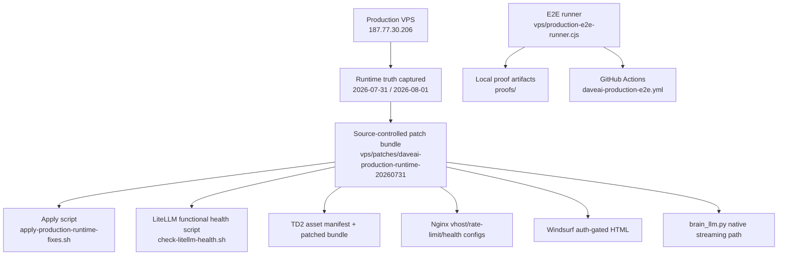
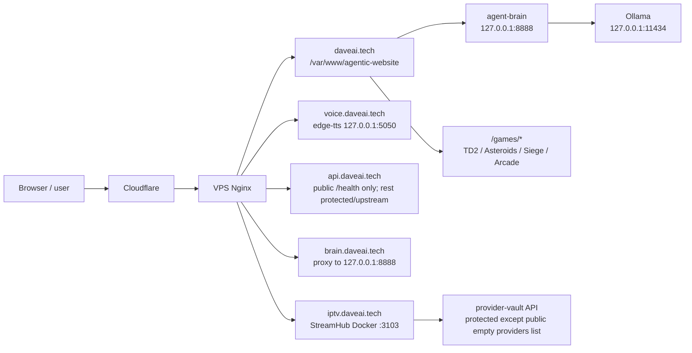

# DaveAI.tech RC1 → RC2 Handoff — 2026-08-01

This is the handoff for continuing DaveAI.tech work on a more stable coding PC with Codex.

## Executive truth

RC1 is not “everything forever complete,” but the production repair work is now source-controlled and reproducible.

RC1 completed:

- main DaveAI chat works again through the native Ollama backend path;
- unauthenticated chat attempts are cleanly auth-gated;
- TD2 missing assets and stale asset cache issue are repaired;
- game carousel launches the selected game;
- StreamHub public page no longer throws provider-vault XHR errors;
- Windsurf/Ops is now properly auth-gated and does not poll protected APIs publicly;
- public health endpoints are green;
- production runtime fixes are persisted in source under `vps/patches/daveai-production-runtime-20260731/`;
- repeatable production E2E runner exists at `vps/production-e2e-runner.cjs`;
- draft PR exists: https://github.com/stackblitz-labs/bolt.diy/pull/2186.

RC1 remaining / RC2 target:

- run authenticated-chat E2E with a real test account or GitHub Actions secrets;
- move from “runtime patch bundle” to the long-term canonical deployment source;
- complete deeper gameplay assertions for all public games, not just smoke/runtime checks;
- run VPS maintenance in a planned window;
- decide how to archive or publish proof artifacts without bloating the repo;
- harden LiteLLM health semantics: functional health works, bare `/health` still hangs.

## Current branches and PRs

Local branch:

```text
chore/daveai-a11y-source-truth-20260725
```

Remote branch:

```text
origin/chore/daveai-a11y-source-truth-20260725
```

Draft PR:

```text
https://github.com/stackblitz-labs/bolt.diy/pull/2186
```

Latest commit:

```text
41e8b61 Persist DaveAI production runtime repairs
```

## Source map



## Production service map



## RC1 production proof summary

Primary proof roots on the original PC:

```text
G:\Github\Bolt.DIY\proofs\daveai-prod-audit-20260731
G:\Github\Bolt.DIY\proofs\daveai-prod-e2e-runner-20260731-rerun
```

Latest repeatable public E2E result:

```text
6 passed, 0 failed, 1 skipped
```

Skipped:

```text
authenticated chat reply
```

Reason:

```text
DAVEAI_E2E_EMAIL and DAVEAI_E2E_PASSWORD were not supplied locally.
```

## How to resume on another PC

1. Copy or clone the repo.

   Preferred if using the prepared copy:

   ```powershell
   cd I:\Github\Bolt.DIY
   git status --short --branch
   ```

   If cloning fresh:

   ```powershell
   cd I:\Github
   git clone https://github.com/Ghenghis/bolt.diy.git Bolt.DIY
   cd I:\Github\Bolt.DIY
   git checkout chore/daveai-a11y-source-truth-20260725
   git pull
   ```

2. Confirm GitHub CLI auth.

   ```powershell
   gh auth status
   gh pr view 2186 --repo stackblitz-labs/bolt.diy
   ```

3. Install/use Node dependencies.

   If `node_modules` was copied, first try:

   ```powershell
   npm run test:daveai:prod
   ```

   If dependencies are missing or stale:

   ```powershell
   pnpm install
   ```

4. Run public production E2E.

   ```powershell
   $env:DAVEAI_PROOF_DIR="I:\Github\Bolt.DIY\proofs\daveai-prod-e2e-rc2"
   npm run test:daveai:prod
   ```

5. Run authenticated chat E2E when a safe test account exists.

   ```powershell
   $env:DAVEAI_E2E_EMAIL="test-account@example.com"
   $env:DAVEAI_E2E_PASSWORD="replace-with-private-value"
   $env:DAVEAI_PROOF_DIR="I:\Github\Bolt.DIY\proofs\daveai-prod-e2e-rc2-auth"
   npm run test:daveai:prod
   ```

Do not commit real credentials.

## RC2 acceptance gates

RC2 should not be called complete until all of these are true:

| Gate | Required proof |
| --- | --- |
| Public E2E | `npm run test:daveai:prod` passes with 0 failed. |
| Authenticated chat E2E | Same runner passes authenticated chat with supplied test account. |
| Durable deployment source | VPS patch bundle is either accepted as the deployment source or migrated into the canonical deploy repo/process. |
| Full game catalog | All public games have at least load/render assertions; top games have input/state assertions. |
| Health | `daveai.tech`, `brain.daveai.tech`, `voice.daveai.tech`, `api.daveai.tech`, and StreamHub provider list health checks are 200. |
| LiteLLM | `check-litellm-health.sh` passes; bare `/health` behavior documented or fixed. |
| VPS maintenance | Maintenance window run completed, reboot done if required, post-reboot smoke green. |
| Proof handling | Proof artifacts copied/archived without bloating Git history unintentionally. |

## What not to do blindly

- Do not run `git reset --hard` on either PC unless the target branch and local user work are explicitly confirmed.
- Do not commit `proofs/` unless intentionally creating a proof archive.
- Do not commit SSH keys, `.env`, cookies, tokens, or private credentials.
- Do not reboot or upgrade the VPS during active user traffic without a maintenance window.
- Do not replace production Nginx configs without `nginx -t` and a backup.

## First RC2 work order

1. On the stable PC, verify the copied checkout:

   ```powershell
   git status --short --branch
   npm run test:daveai:prod
   ```

2. Add real test credentials locally or as GitHub Actions secrets:

   ```text
   DAVEAI_E2E_EMAIL
   DAVEAI_E2E_PASSWORD
   ```

3. Re-run the full runner and confirm 7 passed, 0 failed, 0 skipped.
4. Run the VPS maintenance diagnostic:

   ```bash
   bash vps/vps-maintenance-check.sh
   ```

5. Schedule maintenance window for apt updates/reboot.
6. After reboot, run:

   ```bash
   nginx -t
   systemctl is-active nginx litellm
   pm2 status
   bash vps/patches/daveai-production-runtime-20260731/check-litellm-health.sh
   ```

7. Run `npm run test:daveai:prod` again from the stable PC.
