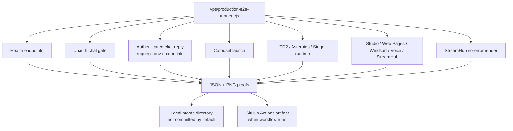
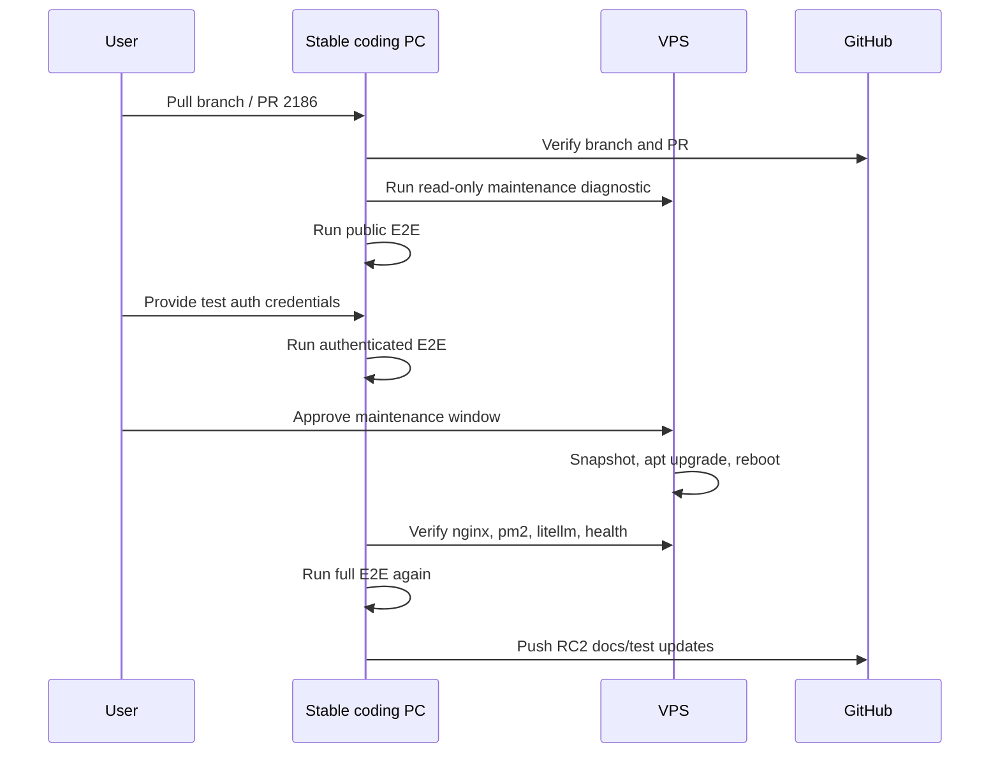

# DaveAI.tech RC2 E2E Roadmap — 2026-08-01

RC2 is the “prove it repeatedly” milestone. RC1 repaired production and captured the repair as source. RC2 should convert that repair into a stable, repeatable, maintenance-safe release flow.

## RC2 completion matrix

| Area | RC1 state | RC2 requirement | Owner action |
| --- | --- | --- | --- |
| Public E2E | 6 passed, 0 failed, 1 auth skipped | 7 passed, 0 failed, 0 skipped | Provide test credentials and rerun. |
| Chat | Public gate + signed-in manual proof works | Automated auth-chat proof in runner/CI | Add `DAVEAI_E2E_EMAIL` and `DAVEAI_E2E_PASSWORD`. |
| Games | Carousel + TD2/Asteroids/Siege smoke green | All public games catalog-smoked; primary games have input/state assertions | Extend `vps/production-e2e-runner.cjs`. |
| TD2 | Runtime repaired with placeholders and cache-bust | Replace placeholders or formally accept placeholders | Decide product-quality bar. |
| StreamHub | Public render clean | Provider-auth tests with test provider account, if available | Add private provider credentials only in secure env. |
| Windsurf | Public auth gate clean | Authenticated admin flow proof, if safe | Use admin/test token only locally. |
| LiteLLM | Functional completion works; bare `/health` hangs | Use functional probe or fix upstream health route | Keep `check-litellm-health.sh`; investigate `/health` separately. |
| VPS | Needs maintenance | Reboot/updates completed in maintenance window; post-reboot E2E green | Schedule downtime, snapshot, update, reboot, verify. |
| Docs | RC1 audit + handoff docs exist | Docs updated after every RC2 proof run | Append proof run IDs and status. |

## E2E architecture



## RC2 test commands

Public:

```powershell
$env:DAVEAI_PROOF_DIR="I:\Github\Bolt.DIY\proofs\daveai-prod-e2e-rc2-public"
npm run test:daveai:prod
```

Authenticated:

```powershell
$env:DAVEAI_E2E_EMAIL="private-test-user"
$env:DAVEAI_E2E_PASSWORD="private-test-password"
$env:DAVEAI_PROOF_DIR="I:\Github\Bolt.DIY\proofs\daveai-prod-e2e-rc2-auth"
npm run test:daveai:prod
```

LiteLLM:

```bash
bash vps/patches/daveai-production-runtime-20260731/check-litellm-health.sh
```

VPS maintenance diagnostic:

```bash
bash vps/vps-maintenance-check.sh
```

## RC2 game proof expansion

Minimum public game checks:

| Game group | Minimum RC2 proof |
| --- | --- |
| Carousel games | iframe launch + direct page render + no bad responses. |
| TD2 | canvas present, no failed assets, click Play if stable, screenshot menu/game state. |
| Asteroids | click Start mission, fire/move input, score/lives/wave state remains readable. |
| Siege TD | enter name, reach menu/campaign controls, no stuck loading. |
| Older arcade games | page render, controls visible, no bad responses/page errors. |
| Checkers Crowning | verify title/H1 and not Wheel of Fortune. |

## RC2 maintenance flow



## Known RC2 risks

- The VPS has high swap use and a reboot-required marker. Maintenance may briefly disturb services.
- Authenticated E2E needs a safe test account; using a real admin/user account in CI is risky unless scoped and rotated.
- TD2 placeholder assets are functional but may not be final product art/audio.
- `proofs/` can grow quickly. Archive intentionally; do not blindly commit.
- Bare LiteLLM `/health` hangs even though readiness/liveliness/completions pass.

## Definition of done for RC2

RC2 is done when:

1. `npm run test:daveai:prod` returns 7 passed, 0 failed, 0 skipped with test credentials.
2. Public GitHub Actions run uploads proof artifacts.
3. VPS maintenance is completed or explicitly deferred with owner/date.
4. Post-maintenance public health and E2E are green.
5. Docs are updated with latest proof paths, dates, and exact remaining items.
6. PR is updated and ready to move from draft to review.
